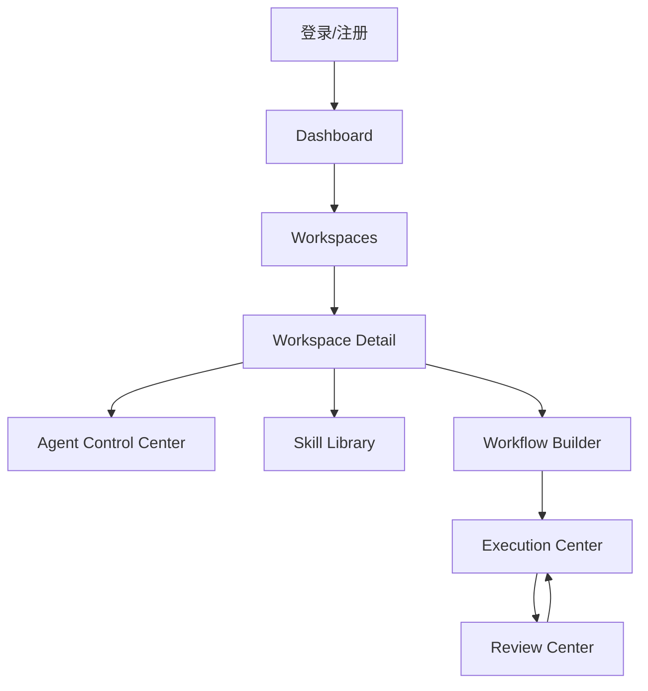

## 1. Product Overview

UuuGent 是一个面向团队与项目协作场景的多 AI Agent 协作工作台（Web MVP）。产品核心不是聊天窗口，而是围绕：

* Workspace（隔离单元）

* Agent（执行主体：模板 + 实例）

* Skill（能力来源：三层作用域）

* Workflow（流转系统：节点编排）

* Review（人工把关：显式节点）

* Execution（执行记录中心：Run/节点运行）

形成“可管理、可追踪、可扩展”的协作闭环。

## 1.1 Key Requirements

* Web 端原型优先交付，视觉与交互参考 iOS（圆角卡片、层级阴影、半透明导航/面板、简洁动效）。

* 系统支持中英文切换，默认简体中文；语言选择在同一账号多端一致（或至少本地持久化）。

* 前后端代码目录清晰分离，便于独立管理、部署与权限隔离。

## 2. Core Features

### 2.0 产品两层结构（Control Plane vs Execution Entry）

1. **Control Plane（管理层）**：配置与管理 Workspace / Agent / Skill / Workflow / Review 规则。

2. **Execution Entry（执行入口层）**：用户以自然语言发起任务，由 Orchestrator 生成计划并驱动执行（Command Center）。

### 2.1 User Roles（MVP）

| 角色         | 注册/加入方式    | 核心权限（MVP 以演示为主）                                                   |
| ---------- | ---------- | ----------------------------------------------------------------- |
| 租户 Owner   | 通过注册/默认种子  | 管理 Workspace；管理模板/实例；管理 Skills；管理 Workflow；进行 Review；查看 Execution |
| 租户 Member  | 通过注册（mock） | 可参与 Workspace，进行配置与运行（后续可加权限边界）                                   |
| Viewer（预留） | 邀请加入（预留）   | 只读查看配置与运行结果（预留）                                                   |

### 2.2 Feature Module（当前系统模块）

页面与模块（路由以 `/app/*` 为主）：

1. **登录/注册**：原型模式的用户名+密码登录/注册与会话。
2. **Dashboard**：系统总览入口（关键指标 + 快捷入口 + 最近运行 + 待审核）。
3. **Command Center**：自然语言任务入口；Orchestrator 生成执行建议与计划；确认后创建 Run 并联动 Execution/Review。
4. **Workspaces**：Workspace 列表/创建/编辑/归档/切换。
5. **Agent Control Center**：系统模板 / 自定义模板 / Workspace 实例三块分区；启用/停用；实例详情。
6. **Skill Library**：三层作用域（Global/Workspace/Agent）+ 绑定关系可视化 + 详情。
7. **Workflow Builder**：线性编排 Start/Agent/Review/End（预留 Condition），按 Workspace 管理。
8. **Execution Center**：运行记录总览（跨 Workspace），可定位当前节点与待审核。
9. **Review Center**：待审核/已审核统一工作台；动作会影响 Run 状态流转。
10. **Settings**：演示工具（重置 mock 数据）与未来租户设置预留。

### 2.3 Page Details（MVP 已实现）

| Page                 | Feature（MVP）                                                                           |
| -------------------- | -------------------------------------------------------------------------------------- |
| 登录/注册                | 用户名+密码；会话保持与退出（mock 模式）                                                                |
| Dashboard            | 指标：Workspace/Active Agents/Workflows/Pending Reviews；快捷入口；最近运行；待审核列表；Skill 使用概览        |
| Command Center       | 自然语言输入 → Orchestrator 建议（Workspace + Agent/Workflow + Plan）→ 用户确认 → 创建 Run/Review 并可追踪 |
| Workspaces           | 列表/创建/编辑/归档；切换当前 workspace；无数据空状态引导                                                    |
| Agent Control Center | 系统模板/自定义模板/实例三块分区；创建模板/实例；启用/停用；实例详情页管理 Skill 绑定                                       |
| Skill Library        | 三层作用域可视化；创建/编辑/归档；详情页显示关联 Agent 使用情况                                                   |
| Workflow Builder     | 按 workspace 创建/编辑 workflow；节点配置 Start/Agent/Review/End（线性）；绑定实例                        |
| Review Center        | 待审核/已审核列表筛选；审批动作（Approve/Reject/Comment）写入历史并驱动 Run 状态变化                               |
| Execution Center     | 全局运行记录中心；按 workspace 筛选；展示当前节点与待审核入口；直达 Run 详情                                         |
| Run Detail           | 展示节点运行状态、产物计数；当 waiting\_review 时可直达对应 Review                                          |
| Settings             | 一键重置演示数据（mockDb），用于 demo 与回归验证                                                         |

## 3. Core Process（演示主链路）

* 基本流程：登录 → 选择/创建 Workspace → 创建 Agent 实例并绑定 Skills → 创建 Workflow（含 Review 节点）→ 在 Execution Center 查看 Runs → 当卡在 Review 时在 Review Center 审核 → 状态回写到 Run 与节点运行。

* 当前阶段数据源：默认使用本地 mock（localStorage），用于演示闭环与验证信息架构/模型/交互节奏。

