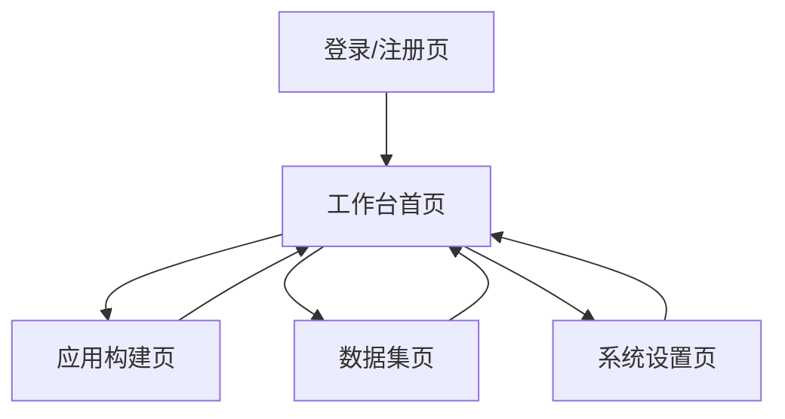

## 1. Product Overview
Ugent 是对 github.com/langgenius/dify 的本地化与品牌化发行版，面向中文团队提供一致的品牌体验与中文界面。
聚焦“品牌替换、语言本地化、可持续二次开发”，确保后续升级与再定制成本可控。

## 2. Core Features

### 2.1 User Roles
| 角色 | 注册/加入方式 | 核心权限 |
|------|----------------|----------|
| 管理员 | 首个管理员初始化或受邀加入 | 配置品牌与语言、管理工作区、管理成员、管理模型/供应商配置、查看系统信息 |
| 成员 | 受邀加入工作区 | 使用应用、管理自己有权限的应用与数据集（按工作区策略） |

### 2.2 Feature Module
Ugent 的核心页面如下：
1. **登录/注册页**：账号登录、注册（可选关闭注册）、找回密码。
2. **工作台首页**：工作区切换、应用入口、数据集入口、最近访问与状态提示。
3. **应用构建页**：应用/工作流创建与编辑、调试预览、发布配置与版本记录。
4. **数据集页**：数据集创建、文档导入与分段、检索测试与权限提示。
5. **系统设置页**：品牌配置（名称/Logo/Favicon/主题色）、语言本地化（默认语言/词条包管理）、二次开发与升级信息（版本、构建信息、变更提示入口）。

### 2.3 Page Details
| Page Name | Module Name | Feature description |
|-----------|-------------|---------------------|
| 登录/注册页 | 登录 | 使用邮箱+密码登录；支持退出与会话保持 |
| 登录/注册页 | 注册与找回 | 支持注册（可由管理员关闭）；通过邮箱完成找回密码 |
| 工作台首页 | 工作区与导航 | 切换当前工作区；进入应用、数据集与设置 |
| 工作台首页 | 入口卡片 | 展示应用列表快捷入口；展示数据集入口与最近访问 |
| 工作台首页 | 系统提示 | 展示升级/维护公告、语言缺失提示、配置缺失提示（如未配置品牌资源） |
| 应用构建页 | 应用列表 | 创建/复制/删除应用；按名称搜索；进入编辑 |
| 应用构建页 | 编辑与调试 | 编辑应用关键配置；在同页进行调试预览与错误提示 |
| 应用构建页 | 发布与版本 | 发布应用；记录发布版本与备注；支持回滚到历史版本（如上游支持） |
| 数据集页 | 数据集管理 | 创建/重命名/删除数据集；展示容量与状态 |
| 数据集页 | 文档导入与处理 | 上传/抓取文档；配置分段与清洗参数；展示处理进度与失败原因 |
| 数据集页 | 检索测试 | 输入查询并查看命中片段；提示语言与分词相关配置影响 |
| 系统设置页 | 品牌配置 | 配置产品名、Logo、Favicon、主题色、登录页文案；实时预览与保存 |
| 系统设置页 | 语言本地化 | 选择默认语言与回退语言；导入/更新词条包；对缺失词条给出提示 |
| 系统设置页 | 二次开发与升级 | 展示当前 Ugent/Dify 版本、构建号、配置来源；提供升级注意事项入口（链接/内嵌说明） |

## 3. Core Process
- 管理员流：登录 → 进入系统设置 → 完成品牌替换（名称/Logo/Favicon/主题色）→ 设置默认语言与词条包 → 回到工作台验证各页展示与文案 → 创建/发布应用给成员使用。
- 成员流：登录 → 工作台选择应用 → 进入应用调试/使用 →（需要知识库时）进入数据集导入文档 → 回到应用进行检索测试与效果验证。

