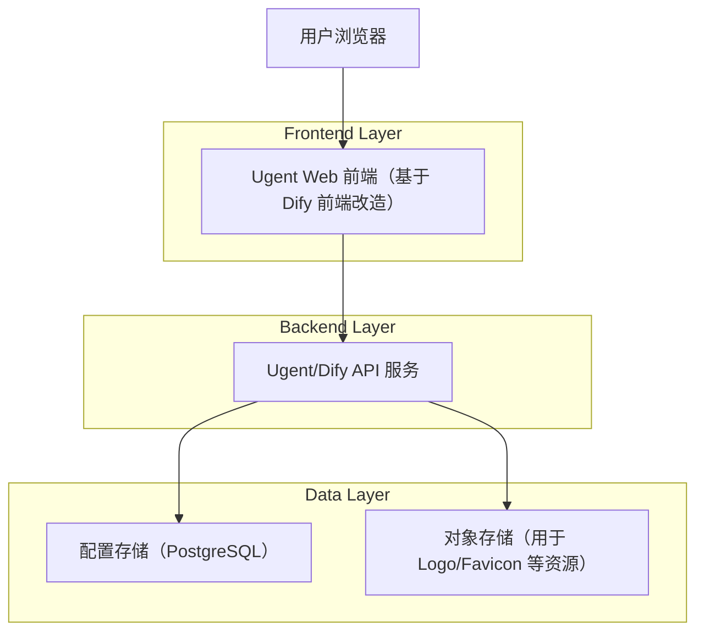
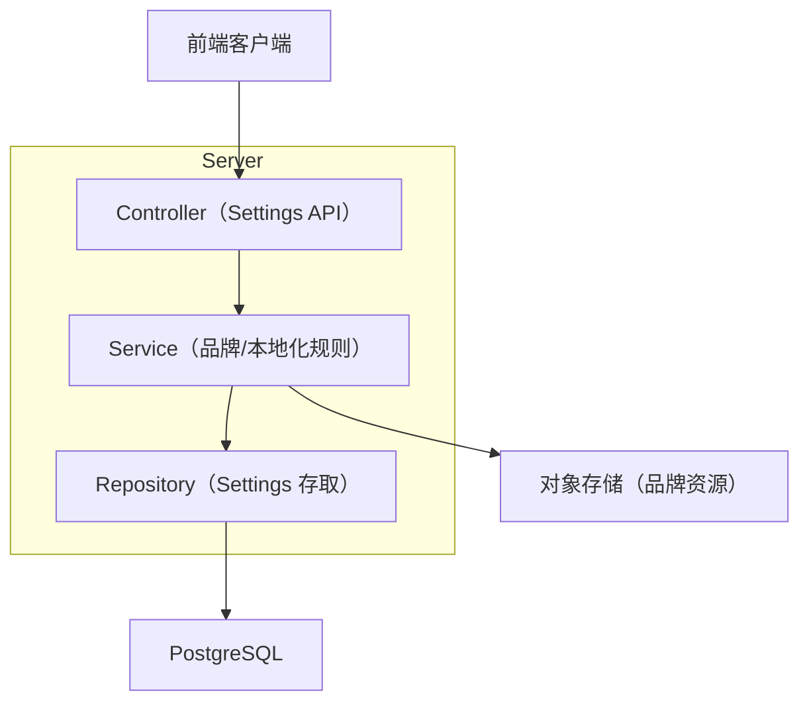
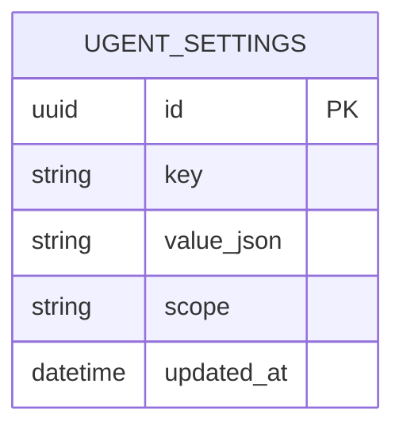

## 1.Architecture design



## 2.Technology Description
- Frontend: React + TypeScript + 路由（React Router 类）+ i18n（推荐 i18next 或上游既有方案）+ UI/样式（TailwindCSS 或上游既有方案）
- Backend: 沿用 Dify 的 API 服务与鉴权体系；新增（或扩展）“品牌与本地化设置”配置接口
- Database: PostgreSQL（沿用上游）；对象存储用于静态品牌资源（Logo/Favicon 等）

## 3.Route definitions
| Route | Purpose |
|-------|---------|
| /login | 登录与找回密码 |
| / | 工作台首页：入口与导航 |
| /apps | 应用列表：创建与进入编辑 |
| /apps/:appId | 应用构建：编辑、调试、发布 |
| /datasets | 数据集列表：创建与进入详情 |
| /datasets/:datasetId | 数据集详情：导入、处理、检索测试 |
| /settings | 系统设置：品牌、语言、二次开发与升级信息 |

## 4.API definitions (If it includes backend services)

### 4.1 Core API
品牌与本地化设置
```
GET /api/ugent/settings
PUT /api/ugent/settings
```

Request (PUT):
| Param Name | Param Type | isRequired | Description |
|-----------|------------|------------|-------------|
| branding  | BrandingSettings | true | 品牌配置（名称、主题色、资源引用等） |
| localization | LocalizationSettings | true | 本地化配置（默认语言、回退语言、词条包版本等） |

Response (GET/PUT):
| Param Name | Param Type | Description |
|-----------|------------|-------------|
| branding  | BrandingSettings | 当前生效的品牌配置 |
| localization | LocalizationSettings | 当前生效的本地化配置 |
| meta | SettingsMeta | 配置来源与版本信息 |

TypeScript shared types（前后端共享）
```ts
export type BrandingSettings = {
  productName: string;
  logoUrl?: string;      // 指向对象存储或静态资源
  faviconUrl?: string;
  primaryColor?: string; // 例如 #2563EB
  loginSlogan?: string;
};

export type LocalizationSettings = {
  defaultLocale: string; // 例如 zh-CN
  fallbackLocale: string; // 例如 en
  i18nBundleVersion?: string;
};

export type SettingsMeta = {
  ugentVersion: string;  // Ugent 发行版版本
  difyVersion?: string;  // 关联的上游版本
  buildId?: string;
  updatedAt: string;
};
```

## 5.Server architecture diagram (If it includes backend services)


## 6.Data model(if applicable)

### 6.1 Data model definition


### 6.2 Data Definition Language
Ugent 设置表（ugent_settings）
```
CREATE TABLE ugent_settings (
  id UUID PRIMARY KEY DEFAULT gen_random_uuid(),
  key VARCHAR(100) NOT NULL,
  value_json JSONB NOT NULL,
  scope VARCHAR(50) NOT NULL DEFAULT 'global',
  updated_at TIMESTAMP WITH TIME ZONE DEFAULT NOW()
);

CREATE UNIQUE INDEX idx_ugent_settings_key_scope ON ugent_settings(key, scope);

-- 建议初始化：全局品牌与本地化默认值
INSERT INTO ugent_settings (key, value_json, scope)
VALUES
  ('branding', '{"productName":"Ugent","primaryColor":"#2563EB"}', 'global'),
  ('localization', '{"defaultLocale":"zh-CN","fallbackLocale":"en"}', 'global');

-- 权限建议（按项目实际 RLS/角色体系调整）
GRANT SELECT ON ugent_settings TO anon;
GRANT ALL PRIVILEGES ON ugent_settings TO authenticated;
```
