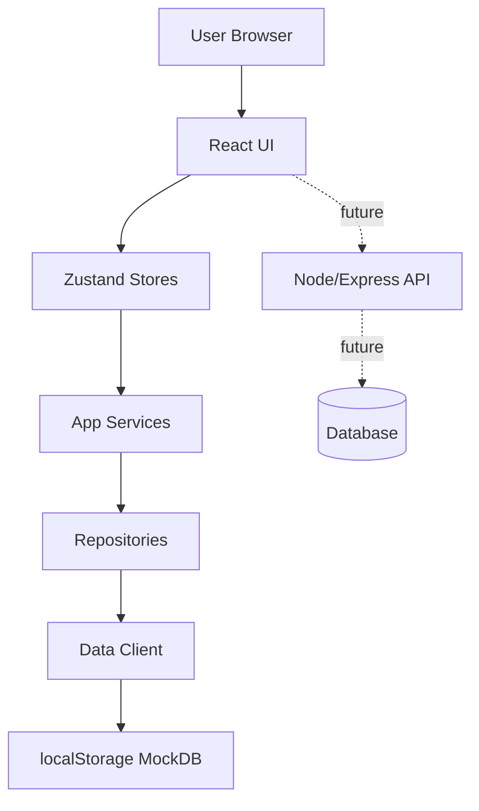

## 1. Architecture Overview（当前 MVP）

当前版本以“可演示 + 可继续开发”的分层为目标：

- UI 层（React 页面/组件）
- 状态层（Zustand stores）
- 用例层（services：聚合加载与跨模块联动）
- 资源访问层（repositories：未来可替换为真实后端）
- 数据实现层（data client：当前为 mock，本地持久化到 localStorage）

## 2. Technology Stack

- Frontend: React + TypeScript + Vite + Tailwind CSS
- Routing: React Router
- State: Zustand
- i18n: i18next + react-i18next（默认 `zh-CN`，支持 `en`）
- Testing: Vitest + Testing Library
- Backend（预留）: Node/Express（当前 dev 进程会启动，但 mock 模式不依赖它）

## 3. Repository Layout

- `src/`: 前端（pages/components/stores/services/repositories/domain/i18n）
- `api/`: 后端 HTTP API（为后续接真实数据/执行器预留）
- `supabase/`: Supabase 相关迁移/实验（历史/预留）
- `.trae/documents/`: 产品/架构/页面设计文档

## 4. Data Source & Persistence

### 4.1 Mock Mode（当前默认）

- 数据源：`src/data/client.ts`（`MODE=mock`）
- 持久化：`localStorage`，核心 key：`uuugent_mockdb_v2`
- 会话：同样存于 mockDb 的 `sessions`，前端保存 access token

说明：mock 数据用于演示主链路与验证模型/信息架构。Settings 提供“重置演示数据”以恢复 demo 场景。

### 4.2 Future Mode（预留）

- `repositories` 是替换边界：未来可切换为真实 API / Supabase / 自建服务
- 运行/审核状态机：当前由 mock data client 实现最小闭环，后续可迁移到后端执行器

## 5. Routing（当前实现）

前端路由以 `/app/*` 为主：

| Route | Purpose |
| --- | --- |
| `/login` | 登录 |
| `/register` | 注册 |
| `/app/dashboard` | Dashboard 总览入口 |
| `/app/command` | Command Center（自然语言任务入口：Plan → Confirm → Run/Review） |
| `/app/workspaces` | Workspace 列表/创建/编辑 |
| `/app/workspaces/:workspaceId` | Workspace 详情（关联 Agents/Skills/Workflows/Reviews/Runs 入口） |
| `/app/agents` | Agent Control Center（模板/实例） |
| `/app/agents/templates/:templateId` | 模板详情 |
| `/app/agents/instances/:agentId` | 实例详情（含 Skill 绑定管理） |
| `/app/skills` | Skill Library（三层作用域） |
| `/app/skills/:skillId` | Skill 详情 |
| `/app/workflows` | Workflow Builder（按 workspace） |
| `/app/workflows/:workflowId` | Workflow 详情 |
| `/app/execution` | Execution Center（全局 runs 总览） |
| `/app/execution/runs/:runId` | Run 详情（节点运行、待审核直达） |
| `/app/reviews` | Review Center（列表/筛选） |
| `/app/reviews/:reviewId` | Review 详情（Approve/Reject/Comment） |
| `/app/settings` | Settings（含重置演示数据） |

## 6. Domain Model（核心概念）

- Tenant / User / Membership
- Workspace（隔离单元）
- AgentTemplate（system/custom）→ WorkspaceAgent（实例）
- Skill（scope: global/workspace/agent）与 SkillBinding（绑定关系）
- Workflow（nodes/edges）
- WorkflowRun / WorkflowNodeRun
- ReviewItem / ReviewAction
- ExecutionLog / AuditRecord（预留/部分 seed）

实体定义集中在 `src/domain/*`，页面通过 `repositories/services/stores` 消费，避免业务结构散落。

## 7. Development & QA

- 启动开发：`npm run dev`（前端 + 后端并行）
- 校验：`npm run check`、`npm run lint`、`npm run test:run`
